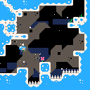

# wasmcompute

**Write Minecraft datapacks in Rust. Run them as vanilla commands or accelerate them with Fabric.**

wasmcompute compiles scalar WebAssembly into `.mcfunction` files using modern
Minecraft arithmetic providers, macros, and `return run`. It is a Rust rewrite
inspired by **SuperTails’ [wasmcraft2](https://github.com/SuperTails/wasmcraft2)**, built for map
makers who want variables, libraries, and ordinary program control flow while
keeping Minecraft's datapack structure and command interface.

> **Experimental • Minecraft Java Edition • datapack format 121**
> Use a Minecraft version that supports format 121. Fast mode deliberately relaxes Wasm semantics.
> The optional accelerator currently supports **Windows and Linux with the same pure-Java jar**.

[Quick start](#quick-start) · [Modes](#choose-an-execution-mode) ·
[Examples](#write-a-datapack) · [Demos](#demos) ·
[Performance](#performance) · [Limitations](#limitations) · [License](#license)

## Demo gallery

<table>
<tr><th>Celeste Classic</th><th>Doom</th></tr>
<tr>
<td></td>
<td></td>
</tr>
</table>

Captured demo frames from deterministic **CPU Wasm replays**, not Minecraft
client screenshots. They show the corrected Celeste palette and Doom gameplay.
The playable Minecraft demos render these games with blocks; block materials
approximate the RGB palette. Celeste also has an exact-RGB display-entity path.
Neither demo needs a resource pack.

## Quick start

Install [Rust](https://www.rust-lang.org/tools/install) and its WebAssembly target.
On Windows, include Rust's MSVC build prerequisites.

From a checkout of this repository:

```sh
rustup target add wasm32-unknown-unknown
cargo build --release
cargo run --release -- build examples/hello -o generated/hello
```

1. Use a test world running **Minecraft Java with datapack format 121** with commands enabled.
2. Copy the entire `generated/hello` directory into `<world>/datapacks/hello`.
3. Run `/reload`, then `/function hello:platform`.

The example places a stone platform and a light relative to you. It does not
run automatically. Install generated output, not the Rust source directory.
If `/compute` is unknown or the pack is rejected, check the Minecraft version.

The built executable is `target/release/wasmcompute` (`.exe` on Windows).
For a portable compiler bundle, keep `bin/` and `sdk/` together; source-pack
builds still require Rust and its Wasm target. A bare `cargo install` executable
without the SDK is not a supported installation layout.

## Choose an execution mode

| | Fast | Accurate | Accelerated |
|---|---|---|---|
| Server | Vanilla | Vanilla | Fabric + wasmcompute mod |
| Build | Default | Add `--accurate` | Either source-pack build |
| Execution | Generated commands | Generated commands + software math | Original Wasm compiled to JVM bytecode |
| Floats | Native f32 providers; f64 loses precision | Software f32/f64 for supported scalar operations | JVM f32/f64 with parity helpers |
| Checks | Relaxed memory and trap behavior | Checked memory and scalar traps | Checked Wasm, with execution/resource limits |
| Use when | Vanilla performance matters most | Numerical behavior matters in vanilla | Server owners accept a mod for speed |

```sh
cargo run --release -- build examples/hello -o generated/hello-fast
cargo run --release -- build examples/hello -o generated/hello-accurate --accurate
```

### Optional Fabric accelerator

The accelerator is a **server-side Fabric mod** that makes generated source
packs run much faster. Vanilla normally executes thousands of Minecraft commands
to perform the program's arithmetic and memory operations. The mod runs the
pack's original WebAssembly through Chicory, which compiles it into JVM
bytecode. Java's JIT then optimizes that code for the server CPU.
Commands such as `fill`, `setblock`, and commands provided by other mods still
run through Minecraft's normal command dispatcher.

To install it:

1. Set up a Fabric server using a [supported version](docs/accelerator.md#compatibility).
2. Download `wasmcompute-accelerator-0.1.0.jar` from the project's release assets,
   or [build the mod](docs/accelerator.md#build-the-fabric-jar).
3. Put the jar in the server's `mods/` folder and restart the server.
4. Install your compiled datapack normally. Keep the complete generated pack,
   including its Wasm payload and metadata. No source changes are needed.

Players can join with an ordinary client; they do not need the mod or a
resource pack. The same pure-Java jar runs on Windows and Linux, with no DLL or shared-library installation.

The mod recognizes generated public functions when datapacks load and replaces
their command-based execution with JVM execution of the original Wasm. Function names,
load/tick tags, command permissions and caller context are preserved. Removing
the mod restores the pack's vanilla fallback after a server restart.

Acceleration uses accurate Wasm arithmetic even if the pack has a Fast fallback.
Build with `--accurate` when numerical parity between vanilla and accelerated
execution matters. Guest state resets on reload; it is not migrated between
backends. [Integration details and compatibility](docs/accelerator.md).

Read the detailed [Fast contract](docs/semantics.md) and
[Accurate contract](docs/accurate.md).

## Write a datapack

Keep Minecraft's folder layout. Replace authored function files with Rust:

```text
my-pack/
├── pack.mcmeta
└── data/
    └── hello/
        ├── function/
        │   └── platform.rs       → /function hello:platform
        ├── advancement/         → normal Minecraft JSON
        └── worldgen/            → normal Minecraft JSON
```

```json
{
  "pack": {
    "description": "My Rust datapack",
    "min_format": 121,
    "max_format": 121
  }
}
```

Each Rust function file provides `pub fn main() -> i32`. Use ordinary Rust
variables and control flow, and Minecraft commands directly:

```rust
pub fn main() -> i32 {
    let width = 5;
    let height = 2;
    minecraft::commands! {
        "say Building a platform from Rust!";
        "fill ~ ~-1 ~ ~$(width) ~-1 ~$(width) minecraft:stone strict", width = width;
    }
    minecraft::command!(
        "setblock ~2 ~$(height) ~2 minecraft:sea_lantern strict",
        height = height
    )
}
```

`command!` returns Minecraft's integer command result. Use `command_success!`
for success or `command_outcome!` for both. `commands!` executes a sequence and
discards results. `fill!` and `execute!` are convenient flat aliases. Template
arguments are evaluated once. Runtime strings use `minecraft::command(&str)`.
Commands keep the caller's executor, position, dimension and permissions.

Small packs need no Cargo manifest. Add `Cargo.toml` for shared Rust helpers and
packages such as Serde; keep helper modules outside `data/*/function/` because
each `.rs` there is a public Minecraft entry point. The default guest is
`no_std`; portable `std` is opt-in and does not provide an OS or WASI.
Normal JSON resources, load/tick tags and existing mcfunctions pass through.

- [Complete source-pack and SDK guide](docs/source-packs.md)
- [Hello: a minimal pack](examples/hello)
- [Cargo + Serde: shareable JSON configuration](examples/source-pack)
- [Low-level Wasm and other languages](docs/other-languages.md)

Build outputs must be outside the source directory. The compiler refuses to
overwrite an unrelated output directory. Guest memory persists between calls
and resets on reload. To spread expensive work across ticks, store progress in
Rust and invoke bounded steps from a tick or scheduled function.

## Demos

| Demo | What it demonstrates | Run/build guide |
|---|---|---|
| Celeste Classic | Original C game, Rust lifecycle, player movement input, batched pixel rendering | [Celeste](demos/celeste-direct/README.md) |
| Doom | Linux Doom engine in Wasm, Rust controls and a 128×80 block screen | [Doom](demos/doom/README.md) |
| Serde | Existing Rust packages serializing shareable configs into Minecraft storage | [Config example](examples/source-pack/README.md) |
| Terrain | Regenerate a finite area using the same or a different seed | [Terrain](demos/terrain/README.md) |

Game assets are external build inputs. Celeste requires the pinned upstream
checkout; Doom requires your own shareware IWAD. Terrain requires extracted
Minecraft 26.2 data and a pinned nightly Rust toolchain. See
[building and installing demos](docs/demos.md). These packs overwrite their
reserved demo areas and change some world/player settings; use separate worlds.

The terrain demo compares a controlled **26.2** generation subset in a world
upgraded to a version supporting datapack format 121. It excludes structures, placed features, legacy carvers,
and eroded-badlands pillars. It replaces block states, not biome metadata.
Vanilla terrain generation is currently far from real time.

## Performance

Measured on a shared Windows i7-13700F machine using headless CPU servers.
Accelerated uses the pure-Java Chicory backend. These are workload measurements,
not universal speed guarantees.

| Test | wasmcraft2¹ | Fast | Accurate | Accelerated |
|---|---:|---:|---:|---:|
| Celeste rendered frame, corrected palette² | 553.63 ms | 44.54 ms | 45.64 ms | 12.72 ms |
| Doom rendered frame³ | 47,173.54 ms | 1,221.74 ms | 1,627.57 ms | 8.32 ms |
| Terrain, full chunk, seed 42 | Unsupported | 533,423 ms | 5,101,366 ms | 260 ms |
| Terrain, full chunk, seed 1337 | Unsupported | 638,979 ms | 5,659,091 ms | 206 ms |
| Serde JSON, per serialization⁴ | 8.413 ms | 3.813 ms | 4.770 ms | 0.184 ms |

¹ The Celeste and Doom baselines run SuperTails' **published playable datapacks**
on Minecraft 1.19.4. They measure elapsed time between completed frames, including
the original VM's scheduled pauses. Current game modes measure execution inside
the server on datapack format 121. The programs, renderers and Minecraft versions
differ, so these are demo comparisons, not isolated compiler speedup measurements.

² Current Celeste uses fixed point and the corrected hair/skin palette, with
180 update/draw calls and real 128×128 block rendering. All three modes matched
180 reference draw results and every block of the final screen. The upstream
128×128 renderer uses its original material palette and buffering.

³ Our Doom result averages 72 frames at 128×80, including the opening wipe and
gameplay. The published wasmcraft2 demo renders at 320×200; its result averages
five frame intervals during its title/attract startup. These are **different
scenes and resolutions**. Both include actual block writes; initialization is
excluded. See the [benchmark details](docs/benchmarks.md) for sample counts and scope.

Terrain includes computation and writes for a 98,304-block chunk, excluding
scheduled gaps, saving and validation. Accurate and Accelerated matched every
tested block for both seeds; Fast differed in 45 blocks for seed 1337.

⁴ Serde uses the **same end-to-end timer for all four modes**: a local client
sends 64 serialization commands and divides the elapsed time by 64. This includes
local command transport and small bookkeeping costs. Game and terrain timings
above use server-side execution timers for the current modes, so their absolute
times should not be compared with Serde's. [Full measurement method](docs/benchmarks.md).

## Limitations

- **Minecraft compatibility.** The compiler targets datapack format 121 and
  its command syntax. Bedrock and older datapack formats are unsupported.
- **Supported scalar Wasm only.** No WASI, threads/atomics, SIMD, memory64,
  multiple memories, dynamic tables, exceptions, GC or component model.
  Unsupported instructions/imports fail compilation.
- **Fast is approximate.** f64 calculations use f32; nonfinite values, rounding,
  out-of-range conversions and trap behavior can differ. Do not use Fast to
  establish numerical parity. Accurate covers the documented subset, not full
  Wasm conformance across every proposal and resource limit.
- **Commands still cost time.** Generated pack sizes, sparse memory access,
  bitwise operations, software floats and large world edits can be expensive.
  Increasing tick rate does not make an over-budget frame fit.
- **No automatic yielding.** A long export can stall a vanilla server or hit its
  command limit. The accelerator imposes execution, memory and callback limits.
- **Accelerator boundaries.** Windows 11 x64 and Ubuntu 24.04 x64 (WSL),
  with Java 25/Fabric 0.19.5, are tested. Very large Wasm functions can exceed
  JVM method-size limits; compilation then fails with a diagnostic. Floating command-template arguments and arbitrary host imports
  are outside its current ABI. Client-side mods are not required.
- **Language frontends.** Rust source packs are integrated. Other languages
  must supply compatible precompiled Wasm and explicit bindings.
- **Trust.** Source-pack Cargo builds can execute build scripts. Commands execute
  with the caller's permissions. Review downloaded source packs/datapacks.

## Development

```sh
cargo fmt --all -- --check
cargo test
cargo test --manifest-path sdk/rust/minecraft-macros/Cargo.toml
python tools/check_release.py
```

CI tests the compiler and SDK, builds Fast/Accurate examples on Windows and
Linux, builds one pure-Java accelerator jar and tests it on both OSes, and creates compiler bundles with
the SDK and notices. It does not launch Minecraft, accept its EULA, or claim to
replace the headless integration/parity benchmarks.

[Contributing](CONTRIBUTING.md) · [Architecture](docs/architecture.md) ·
[Release procedure](docs/releasing.md) · [Security](SECURITY.md)

## License

Original wasmcompute compiler, SDK, tools and accelerator code use
[0BSD](LICENSE): permissive, including commercial use, with **no attribution
requirement**. [0BSD's terms](https://opensource.org/license/0bsd) do not require
retaining a copyright notice in your own work.

Third-party code keeps its own license. The accurate math runtime contains
BSD/MIT code; dependencies have their own notices. The optional Doom engine is
GPL-2.0 and the terrain kernel is AGPL-3.0-or-later. These are separate demo
programs, not compiler dependencies. Game assets and Minecraft data are not
relicensed under 0BSD. Generated programs incorporating third-party code can
still require notices or source distribution. See [THIRD_PARTY.md](THIRD_PARTY.md).

Not an official Minecraft product. Not approved by or associated with Mojang or Microsoft.
